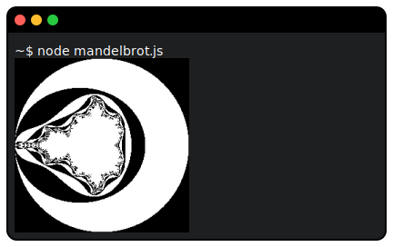

# `@lib/sixel`

[](https://www.npmjs.com/package/@lib/sixel)

Draw indexed color bitmap graphics on terminals [supporting](https://www.arewesixelyet.com/) sixel graphics, without dependencies.



Install:

```bash
npm install --save @lib/sixel
```

## API

***ƒ*** `encodeSixelImage(config: SixelImageConfig): void`

Encode an indexed 256-color image stored as one-byte pixels,
into a string of DEC terminal control codes to render it using sixels.

- `config` Configuration object.

**Ⓘ** `SixelImageConfig`

Configuration for generating a Sixel image.

- `image` Contiguous image buffer, one byte per pixel.
- `width` Image width in pixels, unsigned 16-bit integer.
- `height` Image height in pixels, unsigned 16-bit integer.
- `palette` RGB values 0-1 for every palette index used in image data.
- `write` Callback to write a chunk of output bytes.
  It should make a copy as needed, the same chunk buffer is re-used between calls.
- *`transparentIndex`* Palette index of transparent color (default: no transparency).
- *`stride`* Distance in memory between vertically adjacent pixels
  (default: image width in pixels).
- *`offset`* Byte offset to start of image data (default: 0).

## Example

Create a file `mandelbrot.ts`:

```TypeScript
import { encodeSixelImage } from '@lib/sixel';

const size = 257;
const image = new Uint8Array(size * size);
const step = 4 / (size - 1);
let pos = 0;

for(let b = 2; b >= -2; b -= step) {
    for(let a = -2; a <= 2; a += step) {
        let p = 0, q = 0, i = 0;

        while(i++ < 16 && p * p + q * q < 4) {
            const t = p * p - q * q + a;
            q = 2 * p * q + b;
            p = t;
        }

        image[pos++] = i & 1;
    }
}

encodeSixelImage({
    image,
    width: size,
    height: size,
    palette: [[0, 0, 0], [1, 1, 1]],
    write(chunk: Uint8Array) { process.stdout.write(chunk); }
});

process.stdout.write('\n');

// This is how to output a PGM image instead:
// process.stdout.write('P5 ' + size + ' ' + size + ' 1\n');
// process.stdout.write(image);
```

Run it:

```bash
npx @lib/run mandelbrot
```

It should literally output a fractal image like at the top of this readme.

## More information

- [Sixel](https://en.wikipedia.org/wiki/Sixel) on Wikipedia.
- [Are We Sixel Yet?](https://www.arewesixelyet.com/) - Supported and unsupported terminals.
- [chafa](https://hpjansson.org/chafa/) - Terminal graphics library and tooling (sixel and other alternatives).

# License

0BSD, which means use as you wish and no need to mention this project or its author. Consider it public domain in practice.
